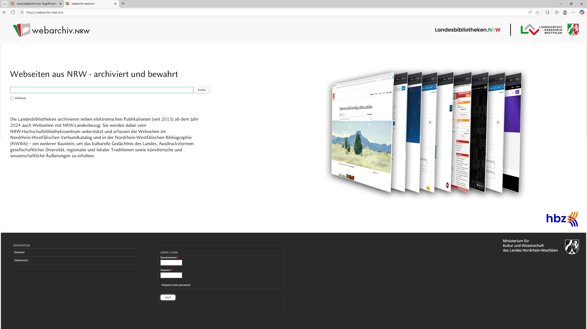

# About

Das nwweb-drupal-theme Drupal Theme basierend auf dem [edoweb Theme](https://github.com/hbz/edoweb-drupal-theme). Es funktioniert nur mit den [to.science.drupal Modulen](https://github.com/hbz/to.science.drupal)

# Installation

Clone the repository to Drupal's theme directory:

    $ cd sites/all/themes
    $ git clone  https://github.com/hbz/nwweb-drupal-theme.git

Activate theme at (e.g. at
<http://localhost/drupal/?q=admin/appearance>).
